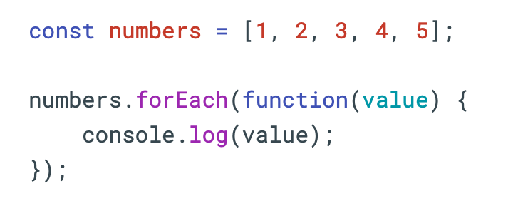

# Lesson 4: Javascript

1. **Scope of variables**

Scope is where a variable can be accessed in code

- Block scope (khối):
    - `var`: not limited by curly braces `{}` (no block scope)
    - `let`/`const`: limited by `{}`. Undefined outsite `{}`
- Function scope (hàm): variables are declared inside a function
    - All `let` / `var` / `const` are not accessible outside the function (undefined)
- Global (Toàn cục): variable is declare in a free line of code, not in the block or function

```markdown
Lưu ý cố gắng khai báo biến trong phạm vi nhỏ nhất
```

2. **Break and continue**

`Break` for immediately exit a loop, program continues after the loop
```markdown
for (let i = 0; i < 10; i++) {
    if i == 5 {
        break; //thoát vòng lặp khi i = 5
    }
    console.log(i);
}
```

`Continue` Skip the current iteration and move to the next one
```markdown
for (let i = 0; i < 10; i++) {
    if i % 2 === 0 {
        continue; //bỏ qua số chẵn
    }
    console.log(i);
}
```

3. **Advanced conditional statements**

`if...else` execute different code for true and false statement
`if...else if` check multiple conditions in order

**Ternary operator** (toán tử điều kiện): Cách viết ngắn gọn cho if...else đơn giản

***Syntax:*** `condition ? value_if_true : value_if_false;`

```markdown
let age = 20;
let status = (age >= 18) ? "Người lớn" : "Trẻ em"; 
console.log(status); // "Người lớn"
```

```markdown
Lưu ý có thể lồng nhau nhưng nên cẩn thận với độ phức tạp
```

4. **Advanced loop**

`for...in` Used to iterate through property names (keys), not values
```markdown
//Với object
const person = {
    name: "John",
    age: 30,
    city: "Ha Noi"
};
for (let key in person) {
    console.log(key + ":" + person[key]);
}
```
```markdown
Not recommended for arrays, often use in API test 
```

`forEach` Used to iterate directly over values, Cannot break or continue


5. **Utils function**

**String utils:**
- Remove space
```markdown
let text = " Hello World ";

// trim() - bỏ khoảng trắng 2 đầu 
console.log(text.trim());
// "Hello World"

// trimStart() - bỏ khoảng trắng bên trái 
console.log(text.trimStart());
// "Hello World

// trimEnd() - bỏ khoảng trắng bên phải 
console.log(text.trimEnd());
// " Hello World"
```
- Case Conversion
```markdown
let str = "JavaScript";
console.log(str.toUpperCase());
// "JAVASCRIPT"
console.log(str.toLowerCase());
// "javascript"
```

- `includes()`
```markdown
let text = "Hello World";
//Kiểm tra chuỗi có chứa chuỗi con không
console.log(text.includes("World")); // true
console.log(text.includes("Hi")); // false
//phân biệt chữ hoa và chữ thường
console.log(text.includes("world")); // false
console.log(text.includes("Hello")); // true
```
- `split`
```markdown
let text = "hello world javaScript";
//Cắt chuỗi theo khoảng trắng
console.log ( text2.split(" ") );
// ["hello", "world", "javaScript"]
let email ="user@gamil.com";
email.split("@");
// ["user", "gamil.com"]
```
- `replace`
```markdown
let text = "Hello World";
//Thay thế chuỗi con
console.log(text.replace("World", "Javascript"));
//Hello Javascript
```

https://developer.mozilla.org/en-US/docs/Web/JavaScript/Reference/Global_Objects/String

**Array utils**
- Add elements (push, unshift, splice)
```markdown
let arr = [1, 2, 3, 4, 5];
arr.push(6); // Thêm phần tử vào cuối mảng
console.log(arr); // [1, 2, 3, 4, 5, 6]

arr.unshift(0); // Thêm phần tử vào đầu mảng
console.log(arr); // [0, 1, 2, 3, 4, 5, 6]

arr.splice(1, 0, 1.5, 1.6, 1.7); // Thêm phần tử vào vị trí index 1, không xóa phần tử nào
console.log(arr); // [1, 1.5, 1.6, 1.7, 2, 3, 4, 5, 6]
```

- Delete elements (pop, shift, splice)
```markdown
let arr = [1, 2, 3, 4, 5]
arr.pop(); // Xóa phần tử cuối cùng của mảng
console.log(arr); // [1, 2, 3, 4]

arr.shift(); // Xóa phần tử đầu tiên của mảng
console.log(arr); // [2, 3, 4]

arr.splice(1,1); // Xóa phần tử tại vị trí index 1
console.log(arr); // [2, 4]
```
- Search (find, filter)
```markdown
let numbers = [1, 2, 3, 4, 5];
// find() - trả về phần tử đầu tiên thỏa mãn điều kiện
let first = numbers.find(num => num > 3);
console.log(first); // 4
// filter() - trả về một mảng chứa tất cả phần tử thỏa mãn điều kiện
let all = numbers.filter(num => num > 3);console.log(all);
// [4, 5]
```
- Array variable (map):
```markdown
let numbers = [1, 2, 3, 4, 5];
// map() - tạo một mảng mới bằng cách áp dụng một hàm cho mỗi phần tử của mảng gốc
let doubled = numbers.map(num => num * 2);
console.log(doubled); // [2, 4, 6, 8, 10]
```

- Organize array (sort)
```markdown
let numbers = [40, 100, 1, 5, 25, 10];
// sắp xếp tăng dần
numbers.sort((a, b) => a - b);
console.log(numbers); // [1, 5, 10, 25, 40, 100]
// sắp xếp giảm dần
numbers.sort((a, b) => b - a);
console.log(numbers); // [100, 40, 25, 10, 5, 1]
```
https://developer.mozilla.org/en-US/docs/Web/JavaScript/Reference/Global_Objects/Array